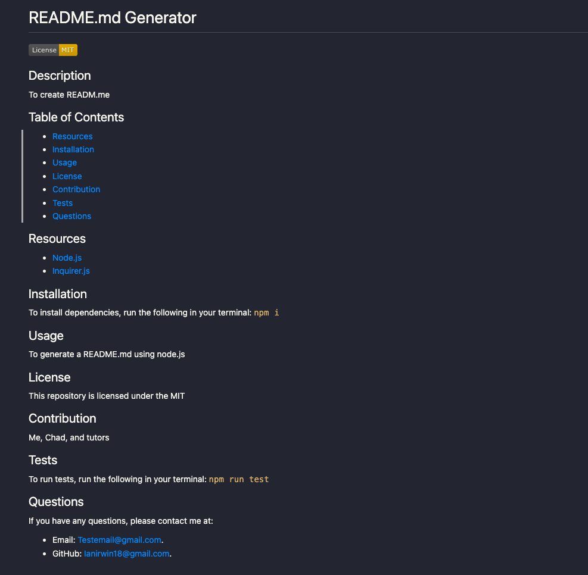

# ReadMe_Gen

Create an easy and professional README.md generator.

# Description

* Create a README.md by using the Inquirer package and node.js
* Include a Demo Walkthrough.
* Include Screenshot of sample README.md

# Demo

Demo Link: https://drive.google.com/file/d/1SxV1Iv07HtI1SuJB1FegefKlL__XBVaF/view?usp=sharing

# ScreenShots

    

# Resources

* Node.js
* Inquirer.js

# License

This repository is licensed under the MIT license.

# Contact info for questions

* Email: Ianirwin18@gmail.com
* Github: IanIrwin18

# Links

* Github: https://github.com/Ianirwin18

* Demo Video: https://drive.google.com/file/d/1SxV1Iv07HtI1SuJB1FegefKlL__XBVaF/view?usp=sharing